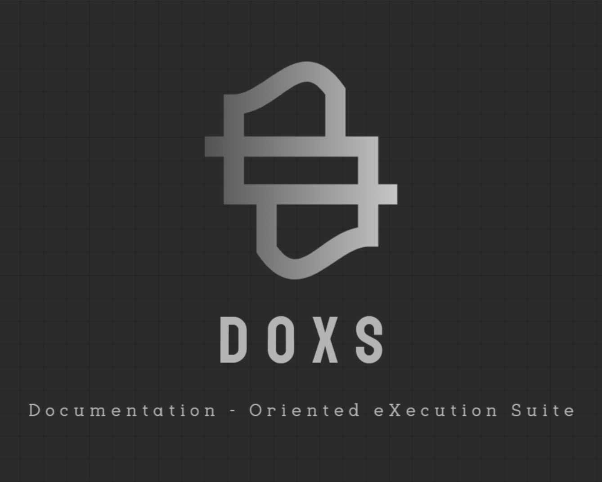

# Doxs Cli
------------


A Command Line Interface Tool for Generating READMEs and Perfect Commits

### Table of Contents

*   [Project Title & Description](#project-title-description)
*   [Installation Instructions](#installation-instructions)
*   [Usage Guide](#usage-guide)
*   [Project Structure](#project-structure)
*   [Key Features](#key-features)
*   [Environment Variables](#environment-variables)
*   [Contributing Guidelines](#contributing-guidelines)
*   [License](#license)

### Project Title & Description

[Doxs Cli](https://github.com/mohitarora8181/dox-cli) is a CLI tool designed to assist developers in creating optimized README files and committing their code with ease. It is designed to be ast and development friendly.

### Installation Instructions

To install Doxs Cli, run the following command:

```bash
npm install -g doxs
```

### Usage Guide

To generate a README or create Commit using Doxs Cli, start with the following command:

```bash
doxs
```

### Project Structure

```markdown
.
├── node_modules
├── package.json
├── index.js
├── generate.js
├── commit.js
├── readme.js
└── analyze.js
```

### Key Features

*   Ast and development friendly
*   CLI tool for generating READMEs
*   Easy code committing

### Environment Variables
Required ```GROQ_API_KEY``` or simply pass ```-k``` or ```--key``` parameter with the cli command .

### Contributing Guidelines

Contributions are welcome. Please visit our GitHub page at [https://github.com/mohitarora8181/dox-cli](https://github.com/mohitarora8181/dox-cli) for more information.

### License

Docs Cli is released under the MIT License.